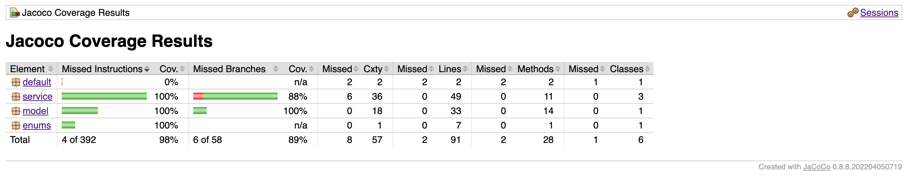

# Projeto de uma máquina lava e seca

Este projeto foi desenvolvido para a disciplina de testes automatizados.
Foi utilizada a linguagem de programação Java, o framework de testes unitários JUnit5, o framework de mock Mockito e a ferramenta de geração de relatório de cobertura de código JaCoCo.

# Documentação máquina lava e seca
Neste documento estão descritas as características e regras para o correto funcionamento da máquina lava e seca.

## Ciclos da máquina: 
  - lavagem;
  - centrifugação;
  - secagem;

## Regra de uso:
  - O ciclo completo deve obedecer a seguinte ordem: lavagem -> centrifugação -> secagem.
  - A máquina pode realizar os ciclos isoladamente: só lavar, só centrifugar, só secar.

## A máquina deve iniciar da seguinte maneira:
  - desligada;
  - temperatura e rotação zerada.

## Quando máquina desligada deve ser possível:
  - Ligar;
  - Abrir porta;
  - Fechar porta.

## Quando máquina ligada deve ser possível:
  - Desligar;
  - Abrir porta;
  - Fechar porta;
  - Lavar;
  - Centrifugar;
  - Secar.

## Casos de Teste Adicionais
- A máquina só pode realizar algum ciclo com a porta fechada e quando estiver ligada.
- A máquina não pode ser desligada sem finalizar ciclo.
- A porta só pode abrir quando não tiver acontecendo algum ciclo.
- Um ciclo não pode iniciar se o outro não tiver sido finalizado.
- Quando desligada e apenas ligada, a temperatura e rotação estão zeradas.
- Quando um ciclo é finalizado, a temperatura e a rotação são zeradas e um SMS pode ser enviado (mock).
- A centrifugação não tem temperatura e não pode passar da rotação máxima.
- A lavagem e secagem não pode passar da temperatura máxima e retorna erro quando temperatura negativa.
- A lavagem e secagem não pode passar da rotação máxima e retorna erro quando rotação negativa.

## Relatório Cobertura com JaCoCo
